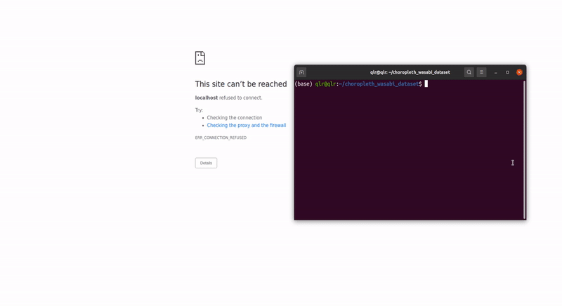

# Wasabi Dataset

### About

Data visualization of the deep learning WASABI songs & artists dataset displaying:

- an interactive choropleth map displaying the amount and concentration of music bands per country, decade and main genre since 1960

- e.g. *the WASABI dataset references 2045 rock bands in the United States of America in the 2000s (20% of referenced bands in the dataset), or c. 6.69 bands per 1m people in the country.*


### Building the website

```sh
# Mounting the website

sudo apt install npm # if not yet installed
npm i
sudo npm install -g parcel-bundler # if not yet installed
parcel index.html
```




### Acknowledgement

This visualization would not have been possible without the code kindly provided by Tzingtao Chow [here](https://github.com/ncovis/choropleth).

Thanks to [enricobachiorrini](https://github.com/enricobachiorrini) for helping with a nifty global variable issue.